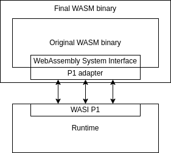
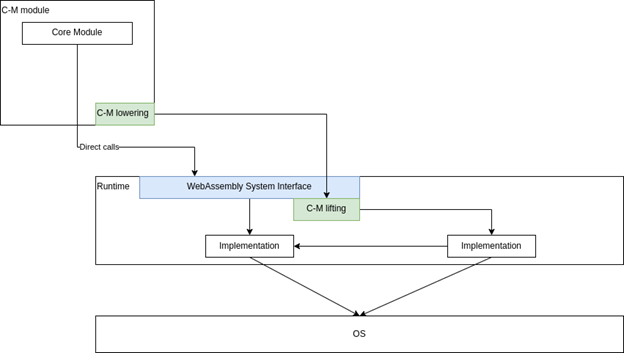

# WASI / Wasm System Structure Exploration of improvements or alternative solutions

# Introduction

The use of WebAssembly (Wasm) in embedded systems may seem unexpected at first, but the same principles that make it a compelling choice for the web, portability, security, and efficient execution, are equally valuable in the embedded space. These attributes have already driven significant adoption. Today, more than a million embedded devices run the WebAssembly Micro Runtime (WAMR) and WASI Preview 1 (original WASI). Several large companies, including Amazon, Sony, and Xiaomi, have embraced this technology, integrating it into their shipping products.

As of early 2025, the WASI 0.2 release is available, with 0.3 expected in the coming months. An initial release candidate for WASI 1.0 is expected to be released by no later than mid-2026, at which point there is a desire to seperate the standardization process by the creation of a new W3C charter - [link with details]([Wasm CG Feburary 2025 - Google Slides](https://docs.google.com/presentation/d/1z0WXS5BLFtbVynM9xAyilecYskN1IKe9Dad1nDEmgU8/edit#slide=id.g33067d21cc1_0_321)).  However, based on current implementations and the publicly shared roadmap, WASI RC 1.0 will be largely unsuitable for embedded applications.

A significant challenge is the **lack of a viable migration path for existing WASI Preview 1 runtimes**. The current WASI roadmap does not provide a way for early adopters to leverage new developments while maintaining their existing investments. At present, the only runtime to support WASI 0.2+ is Wasmtime with other runtimes adopting a cautious "wait and see" stance. Moreover, many existing runtimes—some of which power production systems—are difficult or even impossible to update. The lack of a commitment to maintain the WASI P1 SDK implies that once WASI 1.0 is released existing runtimes will lack a supported path for continued software development. By failing to account for these realities, WASI 1.0 risks alienating its early adopters, undermining the very community that pioneered WebAssembly’s adoption beyond the browser.

Another critical gap is the **absence of low-level, system-oriented APIs** that are both efficient and predictable. Many applications, including backend services and embedded systems, rely on direct, low-level system calls. A major strength of WebAssembly has been its ability to serve as a universal compile target, enabling a wide range of languages and legacy codebases to run in sandboxed environments. The current direction of WASI, however, moves away from this foundational principle, making it harder to support existing code and diminishing WebAssembly’s appeal as a systems-level technology.

Finally, **there is no currently available way for core WebAssembly modules to interact with Component Model-based binaries**. With WASI 0.2, the standard was rewritten around the Component Model making it the foundation for all future WASI development. While the Component Model offers clear advantages for modular application development, its mandatory adoption across all types of WASI applications creates fundamental challenges for system-level programming. As a higher-level abstraction, the Component Model introduces inefficiencies and limitations that make it unsuitable for many low-level use cases. A more flexible approach is needed, one that allows systems-level applications to benefit from WebAssembly’s strengths without being forced into an abstraction that may not align with their requirements.

For WebAssembly to thrive in embedded and systems programming, the community must recognize these challenges and work toward a more inclusive WASI standard, one that provides a path forward for existing runtimes, preserves low-level efficiency, and allows interoperability between core Wasm and Component Model-based applications.  

## Purpose of This Document

The goal of this document is to articulate the requirements essential for WebAssembly (Wasm) and the WebAssembly System Interface (WASI) in embedded systems. It examines the current trajectory of the WASI 0.2 standard and onwards, identifying gaps and challenges that impact embedded use cases. This document aims to highlight areas where the current WASI approach may fall short against the needs of embedded developers and system architects

Beyond analysis, this document also outlines an alternative approach that the Embedded SIG feels better aligns with embedded system constraints and operational realities. This proposal will be presented to the WASI Community Group (WASI CG) to advocate for a more inclusive and adaptable standard—one that ensures WebAssembly’s continued viability in embedded applications while maintaining alignment and compatibility with the broader WASI ecosystem.

## Intended Audience

This document is intended for a wide range of stakeholders within the WASI ecosystem, including:

* **WASI Community Group members and standards contributors** shaping the future of WASI and WebAssembly’s role beyond the browser.  
* **Embedded system developers and architects** who rely on WebAssembly for constrained environments and require predictable, efficient execution.  
* **Runtime maintainers and implementers** responsible for evolving Wasm runtimes and ensuring compatibility with emerging WASI specifications.  
* **Industry leaders and decision-makers** evaluating WebAssembly’s strategic fit within their embedded and edge computing initiatives.

By bringing together these perspectives, this document aims to foster a collaborative discussion on the future of WASI and ensure that embedded system requirements are not only considered but actively incorporated into its evolution.

## Problem Definition

WASI is designed to provide a common build target and system interface for portable applications, spanning environments from microcontrollers to cloud servers. However, each environment has distinct constraints and requirements. The current WASI roadmap, starting from 0.2, introduces a move to the Component Model, prioritizing modularity and high-level abstractions. While beneficial for many workloads, this direction lacks adequate support for performance- and resource-constrained systems and embedded use cases.  These constraints were effectively addressed by the original WASI (Preview 1), making this shift a departure from the support that embedded systems rely upon.

Key challenges include:

1. **Increased overhead and inefficiencies for embedded systems** – The transition to WASI 0.2+ introduces a share-nothing design and Foreign Function Interface (FFI) mechanisms that increase binary size and runtime overhead, making it impractical for constrained environments requiring efficient, low-overhead execution.  
2. **Lack of a clear migration path for existing WASI Preview 1 implementations** – Many existing embedded WASI runtimes cannot be easily updated or retrofitted to support the changes required by the Component Model.  The move to rebase the WASI-SDK on 0.2 and the Component Model, leaves early adopters without a viable path forward.  
3. **Interoperability between core Wasm modules and Component Model binaries** – WASI 0.2+ mandates the Component Model as the foundation for all WASI development, but there is no meaningful way for core WebAssembly modules to interact with Component Model-based binaries. While the Component Model is well-suited for modular application development, making it the sole basis for WASI introduces challenges for low-level, system-oriented programming.

To ensure WebAssembly remains viable across all target environments, a more balanced approach is needed—one that preserves the benefits of WASI’s evolution while maintaining compatibility with the unique demands of embedded systems.

# Status quo

The WASI standards group has released two major versions of the WebAssembly System Interface (WASI), with a third version in development:

* **WASI Preview 1 (P1)** – Originally released six years ago, this version, often called "Original WASI," established a low-level system interface with a design similar to traditional POSIX-style syscalls. It was widely adopted across various WebAssembly runtimes.  
* **WASI 0.2 (previously known as “Preview 2”)** – Announced three years ago and officially released one year ago, this version introduced a fundamental shift by rebasing WASI on the Component Model. This change redefined WASI’s binary format and API design, making it incompatible with Preview 1 at the module level.  
* **WASI 0.3** – Currently in development, this version is expected to be released within the next six months, further iterating on the Component Model-based approach.  It introduces enhancements to asynchronous operations, including the addition of future and stream types

While WASI P2+ runtimes can still execute P1 modules, the reverse is not true—WASI P1 runtimes cannot load P2+ modules without additional tooling or adaptations. This shift has created a divide between existing WASI implementations and the evolving standard, raising concerns about the long-term viability of P1-based runtimes and applications.

## Implementations of WASI Preview 1 vs WASI 0.2 and 0.3

At the time of writing, WASI Preview 1 has been widely implemented across multiple runtimes, including:

* **WasmEdge** – A runtime optimized for cloud-native and edge computing workloads.  
* **WebAssembly Micro Runtime (WAMR)** – A lightweight runtime designed for embedded and resource-constrained environments.  
* **Wasmer** – Support WASI Preview one as well as a proprietary POSIX-like API through the WASIX project.  
* **Wazero** – A zero-dependency WebAssembly runtime for Go.

In contrast, WASI 0.2+ adoption remains limited, with only a few notable implementations:

* **Wasmtime** – The primary implementation and reference runtime for the Component Model-based WASI.  
* **Potentially WasmEdge** – some initial work towards support has begun, but full support has not yet been confirmed.  
* **JCo** – A JavaScript toolchain designed to work with Preview 2+ WASI modules, though it is not a runtime.

With WASI 1.0 expected to finalize this transition, existing WASI Preview 1-based runtimes and applications face an uncertain path forward. The lack of clear migration options risks fragmenting the ecosystem and leaving many early adopters behind.

Beyond the WASI standard, there are academic and experimental implementations which have explored extending WASI Preview 1\.  Projects such as the WebAssembly Linux Interface (WALI)[^1], which explores exposing the Linux kernel APIs via WASI core wasm function imports and exports, paving the way for WASI interfaces to be implemented in a portable, layered way have also been introduced and evaluated.

## Long term Toolchain Support \- Continuing the Legacy of Success

A stable and long-term supported toolchain is essential for any healthy platform and WASI is no exception. Toolchains form the foundation for application portability, enabling developers to build and maintain their software.  A stable toolchain gives developers confidence that their binaries will remain functional across different runtimes and will continue as WASI evolves. However, the ongoing evolution of WASI, particularly the shift introduced with WASI 0.2+, has raised concerns about long-term stability.

The meaningful use of WASI Preview 1 (P1) means that many runtimes and applications depend on its established behavior. Developers have invested significant time and effort into building applications, frameworks, and infrastructure around WASI P1, making it a critical part of the WebAssembly ecosystem. Abandoning these early adopters without a viable migration path risks fragmenting the ecosystem and undermining trust in WASI’s long-term viability. Instead, fostering a healthy ecosystem requires maintaining continuity—allowing developers to leverage improvements in newer WASI versions while ensuring their existing investments remain functional.

For many organizations, particularly those maintaining long-lived software, frequent runtime changes are not feasible. WASI’s toolchain must therefore support stability over time, ensuring that P1-based runtimes remain viable while providing a clear, incremental path for adoption of newer standards. This approach not only protects existing investments but also encourages broader adoption by demonstrating that WASI is a reliable, long-term technology for software development.

## Addressing the Constraints of Embedded Systems

Embedded systems introduce additional challenges that must be considered in WASI’s evolution. Unlike cloud or desktop environments, embedded devices often have fixed or highly constrained resources, long product lifecycles, and limited update capabilities. This makes it impractical to adopt a rapidly evolving standard that requires frequent toolchain changes or significant runtime modifications.

**Performance-Based Design Constraints**  
Embedded systems require predictable performance, minimal startup overhead, and deterministic execution. Any changes to WASI should ensure that new versions do not introduce unnecessary complexity that negatively impacts execution efficiency in resource-constrained environments.

**Low-Level System Constraints**  
Many embedded applications interact directly with hardware through low-level system calls, timers, threading, and memory-mapped I/O. The high-level abstractions introduced with the Component Model in WASI 0.2+ do not generally align well with these needs. To remain viable in embedded environments, WASI must continue to support efficient, low-level system interfaces that allow direct interaction with hardware while maintaining portability.

**Avoiding Dynamic Memory Allocation**  
A key requirement for many embedded applications is minimizing or eliminating completely the use of dynamic memory allocation. Heap-based allocation introduces unpredictability in execution time, increases memory fragmentation, and can lead to system instability, all of which are problematic for real-time and resource-constrained environments. Many embedded systems rely on static memory allocation to ensure deterministic behavior and avoid the overhead of garbage collection or complex memory management. It is therefore important that any dynamic memory allocation should be under explicit control of the developer.

WASI’s evolution should respect these constraints by ensuring that fundamental system interfaces do not require dynamic allocation and that developers have the option to build applications that only perform static memory allocation. 

# Fundamental concerns of the embedded domain

## Fit to its purpose: Performance & low footprint

The design and implementation choices in WASI 0.2 and 0.3 introduce significant overhead that makes them impractical for embedded systems. These newer versions prioritize modularity, language interoperability, and strict sandboxing.  All of these are desirable attributes, but they come at a cost in terms of increased resource consumption and performance. Embedded systems demand minimal overhead, deterministic execution, and direct access to hardware with minimal abstraction.

Key concerns include:

* **Component Model Overhead**: The shift to a strict *shared-nothing* model introduces additional performance costs due to type conversions, automatic marshalling (i.e., lifting and lowering), and parameter passing by value with memory allocation by default. Cyber-physical systems must interact with the real world in real-time, and unnecessary memory copies (when security, synchronization, and data consistency allow) should be avoided. For instance, true zero-copy shared-memory access between a Wasm module and native processes (e.g., via mmap) should be possible—not just limited to streams.  
* **Memory Fragmentation & Stability Risks**: Dynamic memory allocations, frequent re-allocations, and forced memory copies contribute to fragmentation, jeopardizing system stability over long runtimes. This is particularly important on systems that lack virtual memory as most microcontroller-based systems do.  Embedded systems generally require predictable memory management strategies to ensure reliability.  
* **Lack of Low-Level Thread Primitives**: Many embedded applications involve real-world parallelism, where tasks must execute concurrently with strict timing requirements. However, WASI does not provide adequate support for native threading. Embedded systems typically rely on real-time operating systems (RTOS) that manage thread scheduling and priorities to meet deterministic execution requirements. Without direct access to native threads, applications must rely on cooperative multitasking or inefficient workarounds, which can introduce latency and unpredictability. Native threads, scheduled by the RTOS, are generally preferred in embedded environments as they allow fine-grained control over execution order, priority management, and resource allocation.   
* **Asynchronous Execution Challenges**: Embedded devices frequently operate in environments where asynchronous mechanics are critical (e.g., waiting for system resources, handling serial bus communication). While WASI 0.3 introduces planned asynchronous execution mechanisms, it remains unclear if they will meet the needs of embedded systems. Embedded systems often need to prioritize their asynchronous behavior. 

## Differences of priorities/trade-offs that can be taken

Interoperability across multiple programming languages is a key priority in browser and cloud environments, where applications are often composed of components written in different languages that must communicate seamlessly. While this capability is also beneficial in embedded systems, its importance is significantly lower.

Embedded applications are typically developed in a single language, generally C or C++. While WebAssembly can help support programming in multiple languages, this is a secondary concern for embedded systems. Instead, embedded development prioritizes efficiency, determinism, and minimal overhead, as real-time performance and resource constraints are critical concerns.

As such, the focus should remain on ensuring that WASI provides the low-level, predictable system interfaces necessary for embedded applications, rather than introducing additional complexity to optimize for language interoperability. This represents a fundamental difference in priorities compared to the  cloud domains, where higher-level abstractions and language-agnostic design take precedence.

## Maturity and the Importance of a Healthy Ecosystem

In the embedded domain, shipped products often must run for decades. For some systems updates are either impossible or highly undesirable due to downtime, regulatory constraints, or cost. Any change, especially a breaking change, in the runtime or toolchain has a significant impact on both vendors and users. Vendors must adapt or update their tooling, and users face costly and sometimes unfeasible updates. In the worst cases, updating a WASM runtime is not an option at all—examples include consumer devices such as smart TVs, as well as industrial control systems, vehicles, and avionics, where an update might takeing critical infrastructure offline or require a visit to a service center.

With the exception of Wasmtime, most of the community has remained on WASI Preview 1\. This has created a schism where many existing implementations are effectively locked into Original WASI, while new work on WASI Preview 2+ is progressing on a much smaller subset of runtimes. This division hinders ecosystem growth and discourages broader adoption, working against the goals of WASI and web standards as a whole. Addressing this requires tackling a two key challenges:

* **Ensure continuity and evolution** – Sustain and evolve existing WASI runtimes and codebases while minimize complexity and provide backward compatibility.  This will allows developers to build with confidence without major risking of obsolescence.  
* **Enable a path forward** – Ensure that investments made in WASI today remain valuable by offering a well-defined migration path, allowing existing code to be leveraged in future versions with minimal modifications where possible.

As mentioned at the beginning of this section, uncertainty about the stability of WASI impedes adoption. If developers lack confidence that their efforts today will remain relevant in the future, they may hesitate to invest in the WASI ecosystem and instead turn to proprietary solutions that better meet their non-functional requirements. Porting legacy code, which is largely based on C APIs and POSIX primitives, requires significant effort. Making WASI a viable and compelling target for this code is essential to driving adoption, and we should actively support this goal. 

As a group we should work to incorporate migration paths into the standardization process from the outset.  Such an approach would significantly enhance the maturity of WASI, helping it cross the chasm from an evolving technology to a widely adopted industry standard suitable for cloud and embedded computing. Failing to do so risks reinforcing the perception that WASI development is not following a true standardization route but is instead an open-source experiment. This, in turn, would lead to fragmentation, with the very real potential of proprietary WASI implementations filling the gap. We have already seen this with efforts such as WASIX[^2].

# Solution Proposals

## 1: A Layered Approach to WASI

To ensure broad adoption across different domains, it is our proposal that WASI should be structured into distinct layers that clearly separate low-level system primitives from high-level application interfaces. This approach enables both performance-critical operations and flexible, language-agnostic interoperability without forcing unnecessary trade-offs between them.

The Component Model provides a well-defined mechanism for defining Foreign Function Interfaces (FFI) between languages, making it ideal for high-level application APIs. These APIs, analogous to the upper layers of the ISO/OSI model (e.g., Layers 6 and 7), facilitate inter-language communication and abstract system details away from developers. However, in domains like embedded systems, real-time computing, and system-level programming, access to fundamental primitives such as threads, signals, clocks, and serial ports must be as direct and efficient as possible—closer to lower layers (e.g., Layer 5 and below). In these cases, strict inter-language interoperability is often a secondary concern, as developers are accustomed to working with well-defined system primitives, similar to POSIX APIs.

By clearly defining these layers, we can allow high-level APIs to be built on top of low-level primitives without imposing unnecessary constraints. The WebAssembly Application Interface can provide flexible, structured APIs built around the Component Model and the Canonical ABI.  However, these application-level interfaces should be distinct from the low-level WebAssembly System Interface, which provides fundamental operations that are difficult or impossible to emulate.

### Two Related Standards

To support this layered approach, we propose splitting WASI into two separate standards, each with its own scope and governance:

* **WebAssembly System Interface (WSI)** – Defines a low-level, LibC/POSIX-like API for fundamental operations that require direct system access (e.g., interacting with physical devices, low-latency threading, and memory management).  
* **WebAssembly Application Interface (WAI)** – Defines structured, high-level APIs using the Component Model, enabling cross-language interoperability, richer data types, and extensible application interfaces.

| Note:  The above naming is only proposed and is used in this document for clarity when speaking about each, distinct interface layer. |
|:------------------------------------------------------------------------------------------------------------------------------------- |

This might look something like the following:  

The WebAssembly Application Interface may or may not rely on the WebAssembly System Interface, depending on the use case. This separation allows both standards to evolve independently, reducing the risk of performance overhead while maintaining flexibility for higher-level applications.  That said, the WASI CG should strive to coordinate these efforts where possible in order to maintain consistency.  By allowing these two tracks to progress in parallel, we can accelerate the overall development of WASI while ensuring stability and long-term viability.

### Leveraging and Support Investments in WASI Preview 1

From a functional perspective, the WebAssembly System Interface (WSI) will likely encompass the existing WASI Preview 1 functionality while introducing necessary extensions, such as socket and threading support. However, it may be necessary to refine certain API definitions to address known limitations and better align with the long-term goals of the WASI ecosystem.

To ensure backward compatibility with existing P1-based runtimes, we propose a thin adapter layer that translates calls from the new WebAssembly System Interface into P1 interfaces. This adapter could be statically linked to Wasm binaries intended to run on P1-only runtimes, ensuring that applications are supported without requiring major runtime modifications.  

Alternatively, it would be possible to have both the Preview 1 API and the WebAssembly System Interface coexist within a single runtime and, thus, not require an adapter. 

### Avoiding Confusion Between WSI and WAI

A clear distinction between the WebAssembly System Interface (WSI) and the WebAssembly Application Interface (WAI) is essential to prevent confusion among developers and ensure that each serves its intended purpose effectively. Without well-defined boundaries, there is a risk of misplaced expectations, where developers mistakenly assume that high-level application concerns should be addressed at the system level, or that low-level system functionality should conform to application-layer design principles.

By defining explicit criteria for what belongs in each layer, we can ensure that developers understand the trade-offs of working at different levels of the WebAssembly stack, enabling them to make informed decisions when designing and porting applications.

#### WebAssembly System Interface (WSI): Low-Level System Interactions

WSI is responsible for providing system-level primitives, analogous to the role of kernel APIs in traditional operating systems. It serves as the foundation upon which higher-level runtimes and libraries can be built.

**Key Characteristics of WSI:**

* **Low-level system APIs** that provide fundamental operations that cannot be efficiently emulated in user space.  
* **Performance-sensitive primitives** that interact closely with the host system, such as threading, signals, memory management, and hardware access.  
* **Minimal abstraction** to avoid unnecessary complexity or constraints on system implementers.  
* **Compatibility considerations** to provide support for existing and legacy code bases.

**Examples of Features That Belong in WSI:**

* **Core system calls** – APIs for interacting with files, networking, memory, and processes (similar to POSIX or OS-specific syscalls).  
* **Threads and synchronization primitives** – Providing core concurrency mechanisms such as mutexes and condition variables.  
* **Clocks and timers** – Accessing system time with minimal overhead.  
* **Direct hardware interfaces** – Accessing peripherals such as serial ports, raw sockets, and other low-level hardware interactions.  
* **LibC/musl compatibility** – Since traditional C libraries (e.g., musl) act as a bridge to OS-level kernel APIs, they should be implemented against WSI.

#### WebAssembly Application Interface (WAI): Application Development

WAI, on the other hand, provides higher-level APIs designed for application development, leveraging the WebAssembly Component Model. Unlike WSI, which is concerned with low-level primitives, WAI focuses on enabling portable, language-agnostic application development across diverse environments.

**Key Characteristics of WAI:**

* **Language interoperability** – Designed to facilitate seamless communication between different programming languages.  
* **Composability** – Encourages modular application design through reusable Wasm components.  
* **Higher-level abstractions** – Provides APIs that sit above system primitives, offering more developer-friendly interfaces.  
* **Extensibility** – Supports new capabilities without requiring changes to the underlying system runtime.  
* 

**Examples of Features That Belong in WAI:**

* **Networking libraries** – High-level HTTP and WebSocket APIs   
* **Data management** – APIs for interacting with databases that abstract over different storage backends, key/value stores, etc.  
* **Application frameworks** – APIs for handling authentication, message passing, and application lifecycle management.  
* **Standardized data formats** – Common serialization and messaging formats, such as JSON, Protobuf, etc.  
* **GUI frameworks** – Interfaces for rendering and interacting with UI components.

While WAI can be built on top of WSI leveraging low-level operations for its implementation, it is not a requirement. WAI is designed to be independent in both evolution and design, allowing it to grow and adapt without being constrained by the priorities of WSI. In fact, it is entirely possible to have a WAI-only runtime that does not provide support for WSI altogether.  Such a runtime could be highly optimized for specific use cases, such as distributed computing, where only high-level application interfaces are needed.

#### When to Use WSI vs. WAI

Developers must make an **explicit choice** between WSI and WAI based on their **specific needs**:

| Criterion                   | WebAssembly System Interface (WSI)                            | WebAssembly Application Interface (WAI)            |
|:--------------------------- |:------------------------------------------------------------- |:-------------------------------------------------- |
| **Target Audience**         | Systems developers, embedded systems, and runtime maintainers | Application developers, framework maintainers      |
| **Scope**                   | Low-level system operations                                   | High-level application APIs                        |
| **Performance Sensitivity** | Critical (avoids abstraction overhead)                        | Less critical (emphasizes flexibility)             |
| **Backward Compatibility**  | High priority                                                 | Low priority; biases towards rapid evolution       |
| **Example Use Cases**       | Implementing LibC/musl, file system access, threading         | Networking libraries, GUI frameworks, web services |

By clearly defining the target usages, we prevent confusion enabling developers to confidently adopt the right interface for their solutions. This structured layering is key to ensuring the long-term scalability, maintainability, and usability of WASI across different domains, from cloud-native applications to embedded systems.

## 2:  WebAssembly System Interface Standardization Process

To ensure that the WebAssembly System Interface (WSI) evolves in a structured and predictable manner, a **dedicated standardization process** should be established. This process would operate separately from other WASI-related efforts, allowing it to **prioritize the unique needs of low-level system interfaces** while still aligning with the broader WebAssembly ecosystem.

By separating the WSI process from the WAI process, each can **focus on their respective audiences and priorities**.  This might look like the following:

* **WebAssembly System Interface (WSI)** – Targets **low-level system interactions** (e.g., direct hardware access, real-time constraints, and performance-critical operations). The standardization process emphasizes **backward compatibility, deterministic execution, and long-term stability**, which are crucial for embedded and systems-level applications.  
* **WebAssembly Application Interface (WAI)** – Focuses on **higher-level application APIs** built using the Component Model, prioritizing **interoperability, composability, and developer experience** across multiple languages and runtimes. Its standardization process can evolve more rapidly without being constrained by the strict stability and compatibility needs of WSI.  
* 

By decoupling these processes, WSI can maintain a **deliberate, stability-focused evolution** while WAI can continue to iterate independently at a faster pace to serve application developers.

### Key Aspects of the WSI Standardization Process

To establish trust and predictability, the WSI process should include **quality gates** at key phases of development:

* **Migration Strategy Requirements** – By **Phase 2**, every proposal must outline a clear **migration path** for existing WASI applications and runtimes. This ensures that investments made today remain viable over time, reducing ecosystem fragmentation.  
* **Proof of Concept Validation** – By **Phase 4**, proposals must include a **working proof of concept** demonstrating feasibility, ensuring that changes can be adopted without disrupting existing deployments.  
* **Performance Quality Gates** – By **Phase 4**, proposals must meet agreed-upon **performance benchmarks**, ensuring they do not introduce prohibitive regressions—critical for embedded systems and performance-sensitive workloads.  
* **Backwards Compatibility and Non-Functional Requirements (NFR) Matching** – Proposals should strive for **backward compatibility** wherever possible and align with key **non-functional requirements** such as real-time constraints, resource efficiency, and determinism.

By establishing a **dedicated standardization track** for WSI, the WebAssembly ecosystem can ensure that **both system-level and application-level use cases** are addressed **without conflict**. This structured approach fosters **innovation without sacrificing stability**, enabling WASI to become a **trusted foundation** for cloud and embedded computing alike.

# Appendix

## What are The Preview Releases: Introduction to the Component Model and the Canonical ABI

The WASI Component Model extends WebAssembly’s binary format to support modular and composable components, allowing for a structured and flexible application development. Improving maintainability, updateability and countering lack of talent is a much wanted feature set for the embedded domain. Hence, getting to this is highly appreciated\!

The component  model adds layers of abstraction on top of Core Wasm, introducing new instructions and binary formats to handle component instantiation, imports, exports, and communication across boundaries. In its current implementation these changes are not backwards compatible with Core Wasm. To address this and support interoperability, the Component Model employs a bridging mechanism that lifts and lowers data between the Component Model and Core Wasm.  

This is formally defined in the Canonical ABI which defines the mechanisms for lifting and lowering. These formalize how data is transformed to ensure compatibility between the two environments. This includes specifying how complex types are converted into simpler representations and vice versa. For instance, when lifting data from Core Wasm to a component, the ABI defines how to convert Core Wasm types into the component's expected types, and similarly, when lowering data from a component to Core Wasm, it specifies the conversion back to Core Wasm types. Ok, While this addresses the interoperability challenges, it comes with an expense in terms of complexity and \- as stated above \- raises concerns regarding performance and maturity (backward compatibility or migration paths).

The WASI Component Model and WASI P2 introduced a new IDL called WIT. WIT is specifically designed to support the Component Model and the Canonical ABI. It defines how WebAssembly components describe their interfaces (FFI) \- imports, exports, and structured data types. WIT works alongside the Canonical ABI, which defines how data is lifted and lowered to support data exchange between components. WIT is specific to the Component Model and does not apply to Core WebAssembly, as Core Wasm lacks native support for rich interface types supported in WIT. WIT therefore seems to be the right tool to bridge the gap that Core Wasm lacks.

—-

The preview releases introduce the concept of a Component. A Component is a memory isolated block of code with a well defined Foreign Function Interface (FFI). This FFI is defined in WIT (Wasm Interface Type), this is then rendered to language specific functions using a set of code generators. At the time of writing Go, JavaScript and Rust are well supported. There is patchy support for C and C++. 

It is envisaged that Components code be implemented in any desired programming language. 

[^1]:  [https://arxiv.org/abs/2312.03858](https://arxiv.org/abs/2312.03858) 

[^2]:  [https://wasmer.io/posts/announcing-wasix](https://wasmer.io/posts/announcing-wasix) 